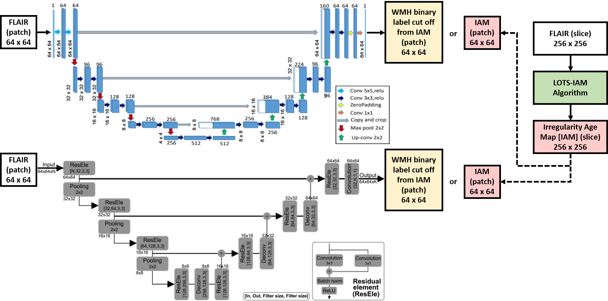

# Transfer Learning for Task Adaptation of Brain Lesion Assessment and Prediction of Brain Abnormalities Progression/Regression using Irregularity Age Map in Brain MRI

### Abstract

The Irregularity Age Map (IAM) for the unsupervised assessment of brain white matter hyperintensities (WMH) opens several opportunities in machine learning-based brain MRI analysis, including transfer task adaptation learning in the MRI brain lesion's segmentation and prediction of lesion progression and regression. The lack of need for manual labels is useful for transfer learning. Whereas, the nature of IAM itself can be exploited for predicting lesion progression/regression. In this study, we propose the use of task adaptation transfer learning for WMH segmentation using CNN through weakly-training UNet and UResNet using the output from IAM and the use of IAM for predicting patterns of WMH progression and regression.

## What is irregularity age map (IAM)?

The irregularity age map (IAM) indicates the degree in which the texture of the neighbourhood around each pixel/voxel differs from the texture of the tissue considered normal. Compared to manually produced WMH binary mask by expert or automatically produced probability mask by machine learning algorithm, information contained/retained in IAM is much richer than the others (see figure below).

## Task Adaptation Transfer Learning in MRI using IAM

Flow chart on how to use IAM produced by an unuspervised method of LOTS-IAM [[1]](https://www.biorxiv.org/content/early/2018/05/30/334292). Deep neural networks used in this study are the U-Net and UResNet. By using IAM produced by an unsupervised method LOTS-IAM, expensive manual labels of WMH are not needed. Note that a lot of manual labels of WMH is needed to train a deep neural networks model. Thus, using IAM, the most expensive resource becomes much cheaper.

## Predicting Regression and Progression of WMH using IAM

As showed in Fig. 1, IAM has an important characteristic where it retains more texture information than probability map or binary mask of WMH. This is very helpful for simulating the regression and progression of WMH (see figure below). Please see the paper for full explanation of the proposed algorithm and discussion.

## Citation

Rachmadi M.F., del C. Valdés-Hernández M., Komura T. (2018) **Transfer Learning for Task Adaptation of Brain Lesion Assessment and Prediction of Brain Abnormalities Progression/Regression Using Irregularity Age Map in Brain MRI.** In: Rekik I., Unal G., Adeli E., Park S. (eds) PRedictive Intelligence in MEdicine. PRIME 2018. Lecture Notes in Computer Science, vol 11121. Springer, Cham. doi: [10.1007/978-3-030-00320-3_11](https://doi.org/10.1007/978-3-030-00320-3_11).

## Release Notes
1. 17/07/2018: File created.

## Acknowledgments
Funds from Indonesia Endowment Fund for Education (LPDP) of Ministry of Finance, Republic of Indonesia and Row Fogo Charitable Trust (Grant No. BRO-D.FID3668413) (MCVH) are gratefully acknowledged. Data collection and sharing for this project was funded by the Alzheimer's Disease Neuroimaging Initiative (ADNI) (National Institutes of Health Grant U01 AG024904) and DOD ADNI (Department of Defense W81XWH-12-2-0012).

## References

 1. Muhammad Febrian Rachmadi,  Maria  Valdés Hernández,  Hongwei  Li,  Ricardo  Guerrero,  Jianguo  Zhang,  Daniel  Rueckert,  Taku  Komura. **Limited One-time Sampling Irregularity Age Map (LOTS-IAM): Automatic Unsupervised Detection of Brain White Matter Abnormalities in Structural Magnetic Resonance Images**. [bioRxiv 334292](https://www.biorxiv.org/content/early/2018/05/30/334292).  doi: [10.1101/334292](https://doi.org/10.1101/334292).
 2. M. F. Rachmadi, M. d. C. Valdés-Hernández and T. Komura, **Automatic Irregular Texture Detection in Brain MRI without Human Supervision**, To be presented in MICCAI 2018, the 21st International Conference on Medical Image Computing and Computer Assisted Intervention. 
 3. M. F. Rachmadi, M. d. C. Valdés-Hernández and T. Komura, **Voxel-based irregularity age map (IAM) for brain's white matter hyperintensities in MRI**, 2017 International Conference on Advanced Computer Science and Information Systems (ICACSIS), Bali, Indonesia, 2017, pp. 321-326.  doi: [10.1109/ICACSIS.2017.8355053](https://doi.org/10.1109/ICACSIS.2017.8355053).
